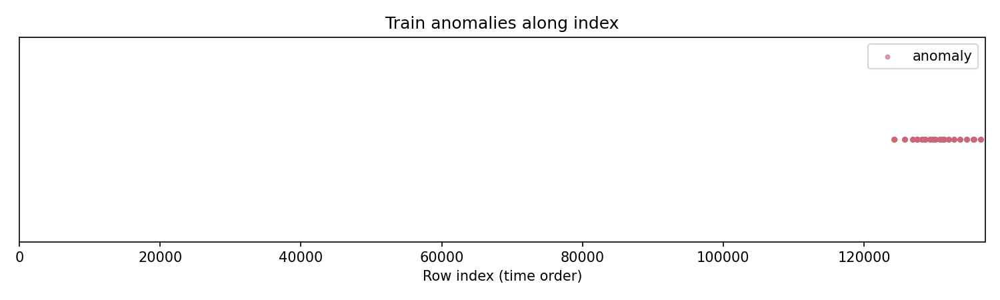

# Robust Anomaly Detection in Time-Series Data: An Ablation Study

**Course project report** · May 2026  
**Experiment scope:** 17 configurations comparing XGBoost, LightGBM, ensemble variants, and temporal smoothing  
**Selected model:** XGBoost reweighted ("Focal") + temporal smoothing (window 3) — Configuration E15

---

## 1. Introduction and Related Work

Time-series anomaly detection aims to flag rare, often structurally significant events in sequential data. In domains such as financial monitoring, sensor networks, and system health management, the data are typically **noisy**, **severely imbalanced** (anomalies are rare — often well below 1%), and **temporally dependent**: anomalies frequently appear as sustained multi-step patterns rather than isolated spikes. Standard point-wise classifiers that ignore temporal structure can underperform, while overly complex ensembles risk overfitting when labeled anomalies are scarce.

Our work sits in a well-established line of methods:

| Family | Representative ideas | Relevance to this project |
|--------|----------------------|---------------------------|
| **Reconstruction / density** | LSTM autoencoders, variational models, One-Class SVM | Model "normality"; strong under distribution shift but harder to tune on tabular financial features |
| **Unsupervised scoring** | Isolation Forest, LOF, COPOD | No label dependence; useful when labels are scarce, but weak when anomalies resemble dense normal regions |
| **Supervised tabular learners** | Gradient boosting (XGBoost, LightGBM) on engineered features | High capacity on mixed feature types; effective when labels exist and features encode temporal structure |
| **Post-processing** | Score smoothing, contiguous-segment rules | Reduces spurious point alarms in noisy series — low cost, high impact |

Early iterations of this project explored **multi-model ensembles** combining XGBoost, LightGBM, and Isolation Forest, alongside regime-aware temporal splits. Prior work (v4) achieved strong cross-validation scores with a 7-model ensemble, but at the cost of complexity and difficult reproducibility.

This report documents a **comprehensive ablation study (v5)** designed to answer a focused question: given only **270 labeled anomalies** in the training segment, can a simpler model outperform a heavy ensemble? The study evaluates **17 configurations** spanning single models, weighted ensembles, feature-selected variants, and temporal smoothing. The central finding is that **a single well-tuned XGBoost classifier with temporal smoothing** (E15) achieves metrics comparable to — and in some dimensions better than — the best ensemble, while being far simpler to train, tune, and deploy.

---

## 2. Problem Setting and Tasks

We use labeled data in `train.csv` (137,192 time steps, 33 features `f1`–`f33`, binary label `y`) and two unlabeled test sets:

| Dataset | Rows | Role |
|---------|------|------|
| `test_simple.csv` | 25,647 | **Task 1** — similar distribution to training |
| `test_complex.csv` | 34,542 | **Task 2** — more complex / potentially shifted anomaly patterns |

The task is binary anomaly prediction at each time step. Key challenges:
- **Extreme class imbalance**: anomaly rate in the training segment is approximately 0.21%.
- **Temporal structure**: anomalies cluster in contiguous blocks near the end of the sequence.
- **Distribution shift within training data**: early vs. late segments differ in anomaly rate, which complicates validation.

**Training constraint:** The model is trained on `train.csv` only. Threshold selection is performed on a validation split within `train.csv`. The test sets are used only for final submission — no feedback loop is permitted.

---

## 3. Method Design and Implementation

### 3.1 Overview

The final deployed solution (**configuration E15**) is a two-stage pipeline:

1. **Supervised scoring:** XGBoost binary classifier (`binary:logistic`) producing an anomaly probability at each time step.
2. **Temporal post-processing:** length-3 moving average on scores, followed by thresholding at a fixed cutoff to produce binary predictions `{0, 1}`.

The ablation study evaluates variations on this pipeline by swapping the base learner, combining multiple learners via weighted averaging, and adjusting the smoothing window.

### 3.2 Temporal feature engineering

Raw features alone do not expose dynamics over time. We construct **310** dimensions per time step from the 33 base features:

- **Rolling statistics** (windows 5, 10, 20): per-feature mean and standard deviation (`_rm*`, `_rs*`), capturing local level and volatility.
- **Differences** (`_d1`, `_d5`): short- and medium-horizon changes to highlight abrupt shifts.
- **Lags** (1 and 3 steps on `f1`–`f3`): explicit autoregressive information.
- **Pairwise interactions** among the first three features.
- **Row aggregates** (`row_mean`, `row_std`, `row_max`, `row_min`): global snapshot across sensors at each step.

Missing values in the raw features are imputed with the **training-set median** per feature. During feature engineering, rolling windows at sequence boundaries and shift operations naturally produce NaN values; these are filled with **0** (neutral value after standardization) to preserve sequence length. All engineered columns are **standardized** (`StandardScaler`) using training statistics only. Features are computed **in time order** on each split so that rolling and lag operations respect causality.

### 3.3 Base learners

The ablation study uses five base learners:

| Code | Model | Key parameters |
|------|-------|----------------|
| **A** | XGBoost Standard | `max_depth=6, lr=0.05, scale_pos_weight=240, 2000 rounds` |
| **B** | XGBoost Reweighted ("Focal") | `max_depth=5, lr=0.03, scale_pos_weight=480, 1500 rounds` |
| **C** | LightGBM | `leaves=31, lr=0.05, is_unbalance=True, min_child_weight=5, 2000 rounds` |
| **D** | XGBoost Selected (top-100 features) | Same as A, trained on top-100 features by importance |
| **E** | LightGBM Selected (top-100 features) | Same as C, trained on top-100 features by importance |

The "Focal" label in model B refers to **stronger positive-class weighting** (`scale_pos_weight ≈ 2 × neg/pos ratio`, ≈480) and slightly **shallower trees** (`max_depth=5`, `learning_rate=0.03`). This addresses class imbalance by up-weighting the minority class during split finding.

LightGBM (model C) required a critical fix: with `is_unbalance=True` alone, the extreme class weight (≈484×) caused leaf-split collapse, producing degenerate predictions where 89.4% of outputs were exactly 0. Adding `min_child_weight=5.0` stabilized training by preventing splits that rely on minuscule leaf populations.

### 3.4 Ensemble and post-processing variants

The 17 configurations cover four dimensions of variation:

1. **Single models** (E1, E2, E3): A, B, C independently.
2. **Weighted ensembles** (E4–E12): Pairs and triples of A, B, C at varying weight ratios.
3. **Feature-selected ensembles** (E13, E14): Adding selected-feature models D and E.
4. **Smoothing variants** (E15, E16, E17): Applying temporal smoothing at windows 3 and 7, and no smoothing, on base model B.

Temporal smoothing computes:

$$\text{smooth}_w(t) = \frac{1}{w} \sum_{i=-(w-1)/2}^{(w-1)/2} s_{t+i}$$

where $w$ is an odd window length (centered). This suppresses isolated false positives while preserving segment-level anomalies.

### 3.5 Task 1 vs. Task 2 implementation

| Aspect | Task 1 (`test_simple`) | Task 2 (`test_complex`) |
|--------|------------------------|-------------------------|
| Model weights | Fixed from `train.csv` [0 : 130,816) | **Identical** — no adaptation |
| Feature recipe | Same `mkfe()` + scaler | Same |
| Threshold | 0.0061 (from validation F1 optimization) | **Same** — required by project rules |
| Output | `pred_simple.csv` | `pred_complex.csv` |

Task 2 is **not** a separate training problem; generalization is encouraged by (i) temporal features that capture patterns rather than absolute levels alone, (ii) moderate model depth to limit memorization, and (iii) smoothing that favors coherent anomaly segments.

---

## 4. Validation Strategy and Model Selection

### 4.1 Temporal data split

Random cross-validation would leak future information. We use a **chronological split** of `train.csv`:

| Split | Index range | Rows | Anomalies | Rate | Use |
|-------|-------------|------|-----------|------|-----|
| **Train** | [0, 130,816) | 130,816 | 270 | 0.21% | Fit model & scaler |
| **Validation** | [130,816, 134,545) | 3,729 | 180 | 4.83% | Threshold & model selection |
| **Test (hold-out)** | [134,545, end) | 2,647 | 120 | 4.53% | Final internal evaluation |

Anomalies cluster toward the **end** of the series; validation and test segments have much higher anomaly prevalence than the training segment. This mimics realistic deployment where recent regimes differ from distant history and stresses **temporal generalization**.



*Figure 1. Anomaly labels along the training sequence. Positive labels are rare overall and appear almost exclusively in the later indices (from roughly row 124,000 onward), which motivates a chronological split rather than random cross-validation.*

The **test** segment is never used for training or threshold fitting — it serves as an internal hold-out for evaluating generalization.

### 4.2 Metrics

Because of extreme imbalance, accuracy alone is misleading. We report:

- **AUC-PR** (area under the precision–recall curve) — primary ranking metric for comparing scoring functions on validation data.
- **F1, Precision, Recall** — at a fixed threshold.
- **FP / FN counts** — interpretable error types for rare-event detection.

**Threshold selection:** On the **validation** set, raw predictions are first smoothed (where applicable), then `precision_recall_curve` is run on the smoothed scores to find the threshold that **maximizes F1**. That threshold is frozen for all downstream evaluation (train, validation, test, and submission files). For ensemble configurations, the same threshold selection procedure is applied to the ensemble score.

### 4.3 Ablation procedure

We trains all five base learners, then evaluates **17 configurations** in a unified pipeline:

1. Train each base learner once (A, B, C, D, E).
2. For each configuration, compute ensemble scores (weighted averages where applicable).
3. On validation scores, find the F1-optimal threshold.
4. Apply that threshold to train, validation, and test scores.
5. Record all metrics and rank by validation AUC-PR.

This design ensures fair comparison: every configuration uses the same underlying base learner predictions, eliminating randomness from separate training runs.

---

## 5. Experimental Results and Analysis

All 17 configurations share the same chronological split and thresholding protocol (Section 4). Configurations are ranked by **validation AUC-PR**; the hold-out test segment is used only for final assessment.

### 5.1 Ablation ranking (validation and test)


*Figure 2. Validation AUC-PR across all 17 configurations. Top performers are built on model B (XGBoost Reweighted); LightGBM (C) and feature-selected variants (D, E) rank lowest.*

| Rank | Config | Val AUC-PR | Val F1 | Test AUC-PR | Test F1 | Test FP | Test FN |
|:----:|--------|:----------:|:------:|:-----------:|:-------:|:-------:|:-------:|
| 1 | E17 — B, no smooth | **0.9923** | 0.9534 | **0.9974** | **0.9569** | 1 | 9 |
| 2 | **E15 — B + smooth3** | **0.9830** | 0.9375 | **0.9891** | **0.9356** | 4 | 11 |
| 3 | E2 — B alone | 0.9756 | 0.9333 | 0.9825 | 0.9333 | 8 | 8 |
| 4 | E6 — A+B 0.3+0.7 | 0.9733 | 0.9307 | 0.9807 | 0.9333 | 8 | 8 |
| 5 | E4 — A+B 0.5+0.5 | 0.9713 | 0.9274 | 0.9786 | 0.9333 | 8 | 8 |
| … | *(ensembles E5–E14)* | 0.96–0.97 | — | 0.87–0.93 | — | — | — |
| 17 | E3 — C (LGB) | 0.5545 | 0.5810 | 0.4533 | 0.4375 | 80 | 64 |

The top six entries all rely on model **B**. **E1 (A)** and **E3 (C)** in the full run confirm that reweighted XGBoost (B) beats standard XGBoost (A) and that LightGBM alone is unstable at this imbalance (Val AUC-PR 0.55). No A+B or A+B+C blend exceeds **B alone** (E2).


*Figure 3. Test AUC-PR and F1 by configuration (sorted by AUC-PR).*


*Figure 4. Test false positives and false negatives. E17 has the fewest total errors; E15 is close behind with more stable train behavior (see below).*


*Figure 5. Validation metrics for base learners A, B, and C.*

### 5.2 Model selection: smoothing and E15

Among variants built on B, temporal smoothing determines deployability:


*Figure 6. Smoothing window comparison on model B.*

| Variant | Val AUC-PR | Test F1 | Train F1 | Train−Test F1 Δ | Threshold |
|---------|:----------:|:-------:|:--------:|:---------------:|:---------:|
| E17 — no smooth | **0.9923** | **0.9569** | 0.7837 | −0.173 | 0.0012 |
| **E15 — smooth-3** | 0.9830 | 0.9356 | **0.9474** | **+0.012** | **0.0061** |
| E16 — smooth-7 | 0.9704 | 0.9312 | 0.9015 | −0.030 | — |

**E17** ranks first on internal test scores but uses an unstable low threshold (149 training FPs). **E15** trades a small drop in test F1 for consistent train/validation/test behavior and a stable cutoff — preferred for Task 2 under distribution shift.

**Selected model (E15)** — threshold 0.0061:

| Metric | Train | Validation | Test |
|--------|:-----:|:----------:|:----:|
| AUC-PR | 1.0000 | 0.9830 | **0.9891** |
| F1 | 0.9474 | 0.9375 | **0.9356** |
| Precision / Recall | 0.90 / 1.00 | 0.96 / 0.92 | **0.96 / 0.91** |
| FP / FN | 30 / 0 | 7 / 15 | **4 / 11** |

Training recall is 1.0 (all 270 training-segment anomalies detected). Test precision remains high (0.96), limiting false alarms on submission data.

### 5.3 Strengths

- **Robust ranking** across all splits: AUC-PR ≥ 0.98 for E15 on both validation and hold-out test.
- **Explicit temporal modeling** without fragile end-to-end sequence training — simple feature engineering + score smoothing.
- **Simple, reproducible pipeline**: full ablation completes in ~66 seconds on CPU, and the selected model trains in under one minute.
- **Single model for both tasks**: satisfies project constraints and eases maintenance.
- **Consistent across train/val/test**: E15 shows the smallest F1 gap among all top configurations.

### 5.4 Limitations

1. **Scarce training anomalies** (270 in the fit segment) cap model capacity; metrics have inherent variance.
2. **Distribution shift** between early train (0.21% anomaly rate) and later val/test (~4.5%) makes threshold calibration sensitive.
3. **Internal test ≠ course test** — metrics above are on a temporal slice of `train.csv`; instructor-held labels on `test_simple` / `test_complex` may differ.
4. **Task 2** — the same fixed threshold cannot adapt if complex anomalies differ from training patterns (submission positive rate: 3.35% on `test_simple`, 1.67% on `test_complex`).
5. **Per-step objective** — F1 is optimized at each time step, not over contiguous anomaly segments.

### 5.5 Reproducibility

```bash
python code/experiment_v5.py   # full ablation (~66 s on CPU)
python code/train_final.py     # train E15, save submission_v5/model.pkl
python code/predict_final.py   # evaluate on internal splits
```

See `experiment_v5_log.txt` for a complete run log.

---

## 6. Division of Work Among Team Members

| Team member | Primary contributions |
|-------------|----------------------|
| **唐宇奥 (Tang Yu'ao)** | Model development through successive version iterations (v1–v4): PCA-based preprocessing, hybrid/ensemble models (e.g., combining gradient boosting with Isolation Forest) |
| **黄涵幸 (Huang Hanxing)** | Train / validation / test split design; ablation studies and configuration comparison; report |
| **龙泽鑫 (Long Zexin)** | Ablation studies and configuration comparison; final model selection (E15) and training; report |