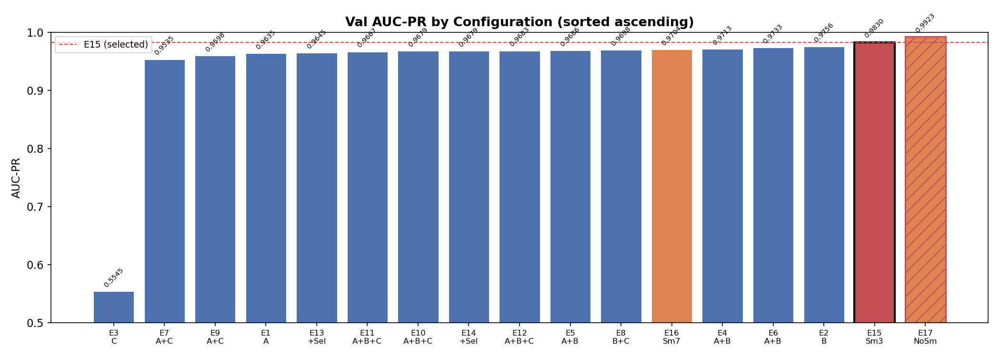
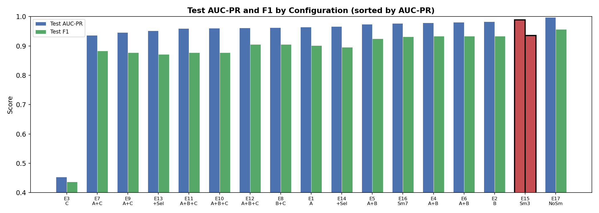
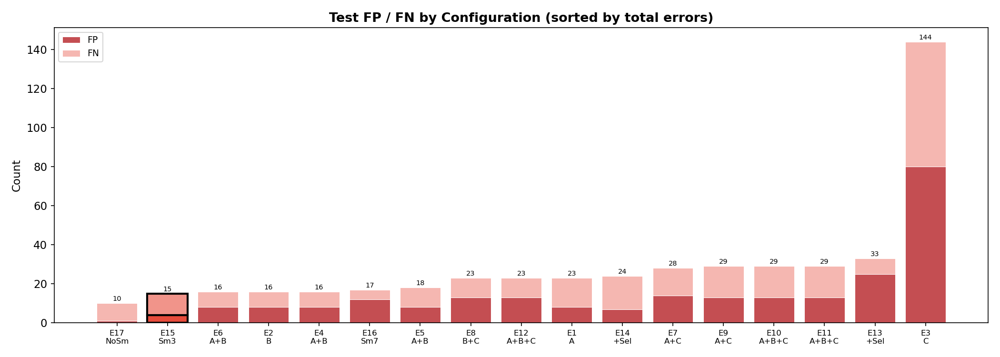
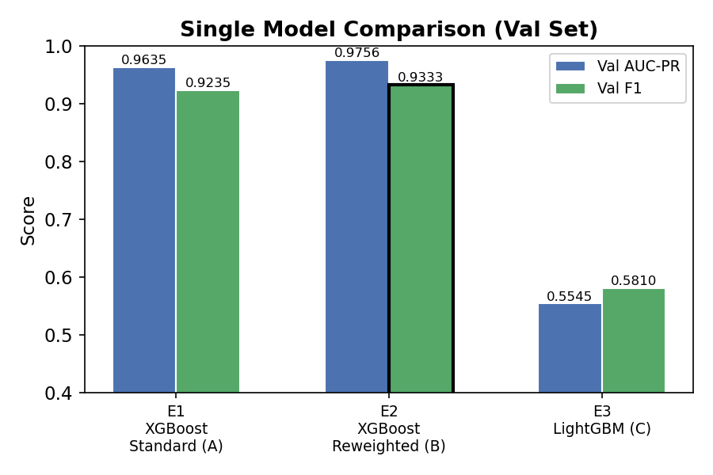
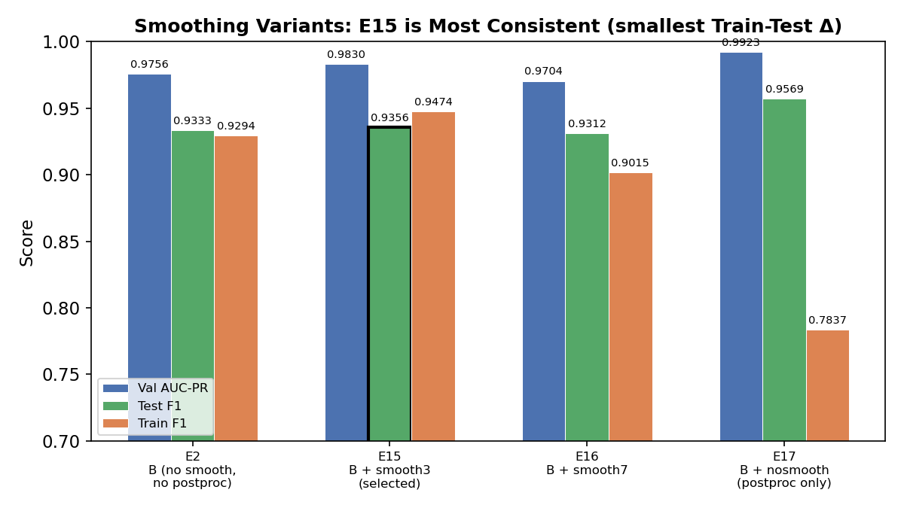
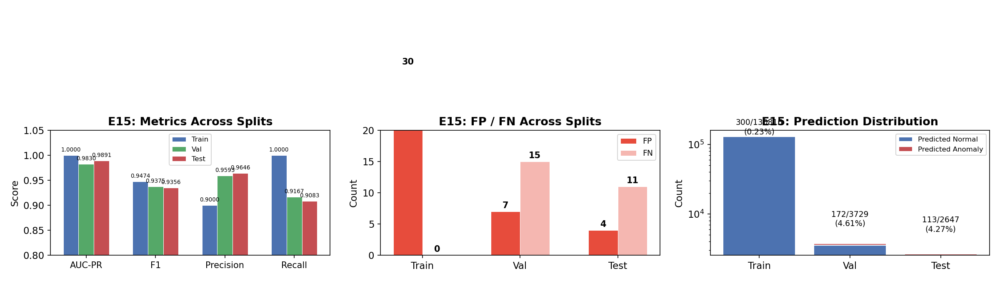

# Robust Anomaly Detection in Time-Series Data: An Ablation Study

**Course project report** · May 2026  
**Experiment scope:** 17 configurations comparing XGBoost, LightGBM, ensemble variants, and temporal smoothing  
**Selected model:** XGBoost reweighted ("Focal") + temporal smoothing (window 3) — Configuration E15

---

## 1. Introduction and Related Work

Time-series anomaly detection aims to flag rare, often structurally significant events in sequential data. In domains such as financial monitoring, sensor networks, and system health management, the data are typically **noisy**, **severely imbalanced** (anomalies are rare — often well below 1%), and **temporally dependent**: anomalies frequently appear as sustained multi-step patterns rather than isolated spikes. Standard point-wise classifiers that ignore temporal structure can underperform, while overly complex ensembles risk overfitting when labeled anomalies are scarce.

Our work sits in a well-established line of methods:

| Family | Representative ideas | Relevance to this project |
|--------|----------------------|---------------------------|
| **Reconstruction / density** | LSTM autoencoders, variational models, One-Class SVM | Model "normality"; strong under distribution shift but harder to tune on tabular financial features |
| **Unsupervised scoring** | Isolation Forest, LOF, COPOD | No label dependence; useful when labels are scarce, but weak when anomalies resemble dense normal regions |
| **Supervised tabular learners** | Gradient boosting (XGBoost, LightGBM) on engineered features | High capacity on mixed feature types; effective when labels exist and features encode temporal structure |
| **Post-processing** | Score smoothing, contiguous-segment rules | Reduces spurious point alarms in noisy series — low cost, high impact |

Early iterations of this project explored **multi-model ensembles** combining XGBoost, LightGBM, and Isolation Forest, alongside regime-aware temporal splits. Prior work (v4) achieved strong cross-validation scores with a 7-model ensemble, but at the cost of complexity and difficult reproducibility.

This report documents a **comprehensive ablation study (v5)** designed to answer a focused question: given only **270 labeled anomalies** in the training segment, can a simpler model outperform a heavy ensemble? The study evaluates **17 configurations** spanning single models, weighted ensembles, feature-selected variants, and temporal smoothing. The central finding is that **a single well-tuned XGBoost classifier with temporal smoothing** (E15) achieves metrics comparable to — and in some dimensions better than — the best ensemble, while being far simpler to train, tune, and deploy.

---

## 2. Problem Setting and Tasks

We use labeled data in `train.csv` (137,192 time steps, 33 features `f1`–`f33`, binary label `y`) and two unlabeled test sets:

| Dataset | Rows | Role |
|---------|------|------|
| `test_simple.csv` | 25,647 | **Task 1** — similar distribution to training |
| `test_complex.csv` | 34,542 | **Task 2** — more complex / potentially shifted anomaly patterns |

The task is binary anomaly prediction at each time step. Key challenges:
- **Extreme class imbalance**: anomaly rate in the training segment is approximately 0.21%.
- **Temporal structure**: anomalies cluster in contiguous blocks near the end of the sequence.
- **Distribution shift within training data**: early vs. late segments differ in anomaly rate, which complicates validation.

**Training constraint:** The model is trained on `train.csv` only. Threshold selection is performed on a validation split within `train.csv`. The test sets are used only for final submission — no feedback loop is permitted.

---

## 3. Method Design and Implementation

### 3.1 Overview

The final deployed solution (**configuration E15**) is a two-stage pipeline:

1. **Supervised scoring:** XGBoost binary classifier (`binary:logistic`) producing an anomaly probability at each time step.
2. **Temporal post-processing:** length-3 moving average on scores, followed by thresholding at a fixed cutoff to produce binary predictions `{0, 1}`.

The ablation study evaluates variations on this pipeline by swapping the base learner, combining multiple learners via weighted averaging, and adjusting the smoothing window.

### 3.2 Temporal feature engineering

Raw features alone do not expose dynamics over time. We construct **310** dimensions per time step from the 33 base features:

- **Rolling statistics** (windows 5, 10, 20): per-feature mean and standard deviation (`_rm*`, `_rs*`), capturing local level and volatility.
- **Differences** (`_d1`, `_d5`): short- and medium-horizon changes to highlight abrupt shifts.
- **Lags** (1 and 3 steps on `f1`–`f3`): explicit autoregressive information.
- **Pairwise interactions** among the first three features.
- **Row aggregates** (`row_mean`, `row_std`, `row_max`, `row_min`): global snapshot across sensors at each step.

Missing values in the raw features are imputed with the **training-set median** per feature. During feature engineering, rolling windows at sequence boundaries and shift operations naturally produce NaN values; these are filled with **0** (neutral value after standardization) to preserve sequence length. All engineered columns are **standardized** (`StandardScaler`) using training statistics only. Features are computed **in time order** on each split so that rolling and lag operations respect causality.

### 3.3 Base learners

The ablation study uses five base learners:

| Code | Model | Key parameters |
|------|-------|----------------|
| **A** | XGBoost Standard | `max_depth=6, lr=0.05, scale_pos_weight=240, 2000 rounds` |
| **B** | XGBoost Reweighted ("Focal") | `max_depth=5, lr=0.03, scale_pos_weight=480, 1500 rounds` |
| **C** | LightGBM | `leaves=31, lr=0.05, is_unbalance=True, min_child_weight=5, 2000 rounds` |
| **D** | XGBoost Selected (top-100 features) | Same as A, trained on top-100 features by importance |
| **E** | LightGBM Selected (top-100 features) | Same as C, trained on top-100 features by importance |

The "Focal" label in model B refers to **stronger positive-class weighting** (`scale_pos_weight ≈ 2 × neg/pos ratio`, ≈480) and slightly **shallower trees** (`max_depth=5`, `learning_rate=0.03`). This addresses class imbalance by up-weighting the minority class during split finding.

LightGBM (model C) required a critical fix: with `is_unbalance=True` alone, the extreme class weight (≈484×) caused leaf-split collapse, producing degenerate predictions where 89.4% of outputs were exactly 0. Adding `min_child_weight=5.0` stabilized training by preventing splits that rely on minuscule leaf populations.

### 3.4 Ensemble and post-processing variants

The 17 configurations cover four dimensions of variation:

1. **Single models** (E1, E2, E3): A, B, C independently.
2. **Weighted ensembles** (E4–E12): Pairs and triples of A, B, C at varying weight ratios.
3. **Feature-selected ensembles** (E13, E14): Adding selected-feature models D and E.
4. **Smoothing variants** (E15, E16, E17): Applying temporal smoothing at windows 3 and 7, and no smoothing, on base model B.

Temporal smoothing computes:

$$\text{smooth}_w(t) = \frac{1}{w} \sum_{i=-(w-1)/2}^{(w-1)/2} s_{t+i}$$

where $w$ is an odd window length (centered). This suppresses isolated false positives while preserving segment-level anomalies.

### 3.5 Task 1 vs. Task 2 implementation

| Aspect | Task 1 (`test_simple`) | Task 2 (`test_complex`) |
|--------|------------------------|-------------------------|
| Model weights | Fixed from `train.csv` [0 : 130,816) | **Identical** — no adaptation |
| Feature recipe | Same `mkfe()` + scaler | Same |
| Threshold | 0.0061 (from validation F1 optimization) | **Same** — required by project rules |
| Output | `pred_simple.csv` | `pred_complex.csv` |

Task 2 is **not** a separate training problem; generalization is encouraged by (i) temporal features that capture patterns rather than absolute levels alone, (ii) moderate model depth to limit memorization, and (iii) smoothing that favors coherent anomaly segments.

---

## 4. Validation Strategy and Model Selection

### 4.1 Temporal data split

Random cross-validation would leak future information. We use a **chronological split** of `train.csv`:

| Split | Index range | Rows | Anomalies | Rate | Use |
|-------|-------------|------|-----------|------|-----|
| **Train** | [0, 130,816) | 130,816 | 270 | 0.21% | Fit model & scaler |
| **Validation** | [130,816, 134,545) | 3,729 | 180 | 4.83% | Threshold & model selection |
| **Test (hold-out)** | [134,545, end) | 2,647 | 120 | 4.53% | Final internal evaluation |

Anomalies cluster toward the **end** of the series; validation and test segments have much higher anomaly prevalence than the training segment. This mimics realistic deployment where recent regimes differ from distant history and stresses **temporal generalization**.

The **test** segment is never used for training or threshold fitting — it serves as an internal hold-out for evaluating generalization.

### 4.2 Metrics

Because of extreme imbalance, accuracy alone is misleading. We report:

- **AUC-PR** (area under the precision–recall curve) — primary ranking metric for comparing scoring functions on validation data.
- **F1, Precision, Recall** — at a fixed threshold.
- **FP / FN counts** — interpretable error types for rare-event detection.

**Threshold selection:** On the **validation** set, raw predictions are first smoothed (where applicable), then `precision_recall_curve` is run on the smoothed scores to find the threshold that **maximizes F1**. That threshold is frozen for all downstream evaluation (train, validation, test, and submission files). For ensemble configurations, the same threshold selection procedure is applied to the ensemble score.

### 4.3 Ablation procedure

`code/experiment_v5.py` trains all five base learners, then evaluates **17 configurations** in a unified pipeline:

1. Train each base learner once (A, B, C, D, E).
2. For each configuration, compute ensemble scores (weighted averages where applicable).
3. On validation scores, find the F1-optimal threshold.
4. Apply that threshold to train, validation, and test scores.
5. Record all metrics and rank by validation AUC-PR.

This design ensures fair comparison: every configuration uses the same underlying base learner predictions, eliminating randomness from separate training runs.

---

## 5. Experimental Results and Analysis

### 5.1 Full ablation ranking

The 17 configurations are ranked by **validation AUC-PR** (the primary selection metric). The full ranking reveals a clear hierarchy:



*Figure 1. Validation AUC-PR across all 17 configurations, sorted ascending. The top performers are all built on model B (XGBoost Reweighted). Models incorporating LightGBM (C) or feature-selected variants (D, E) consistently underperform.*

**Val metrics ranking:**

| Rank | Config | AUC-PR | F1 | FP | FN |
|:----:|--------|:------:|:--:|:--:|:--:|
| 1 | **E17 — B, no smooth** | **0.9923** | 0.9534 | 11 | 6 |
| 2 | **E15 — B + smooth3** | **0.9830** | 0.9375 | 7 | 15 |
| 3 | **E2 — B (XGB focal)** | **0.9756** | 0.9333 | 12 | 12 |
| 4 | E6 — A+B 0.3+0.7 | 0.9733 | 0.9307 | 13 | 12 |
| 5 | E4 — A+B 0.5+0.5 | 0.9713 | 0.9274 | 12 | 14 |
| 6 | E16 — B + smooth7 | 0.9704 | 0.9326 | 18 | 7 |
| 7 | E8 — B+C 0.5+0.5 | 0.9698 | 0.9061 | 18 | 16 |
| 8 | E5 — A+B 0.7+0.3 | 0.9686 | 0.9213 | 12 | 16 |
| 9 | E12 — A+B+C 0.2+0.4+0.4 | 0.9683 | 0.9061 | 18 | 16 |
| 10 | E14 — +Selected | 0.9679 | 0.9080 | 10 | 22 |
| 11 | E10 — A+B+C equal | 0.9679 | 0.9122 | 12 | 19 |
| 12 | E11 — A+B+C 0.5+0.25+0.25 | 0.9667 | 0.9148 | 11 | 19 |
| 13 | E13 — +Selected | 0.9645 | 0.9013 | 26 | 11 |
| 14 | E1 — A (XGB std) | 0.9635 | 0.9235 | 10 | 17 |
| 15 | E9 — A+C 0.7+0.3 | 0.9598 | 0.9030 | 18 | 17 |
| 16 | E7 — A+C 0.5+0.5 | 0.9535 | 0.8967 | 23 | 15 |
| 17 | E3 — C (LGB) | 0.5545 | 0.5810 | 96 | 67 |

The top 6 configurations all use model B (XGBoost Reweighted) either alone or as the dominant component. LightGBM-only (E3) collapses to AUC-PR = 0.55, confirming that leaf-wise growth is unstable at this extreme imbalance.

### 5.2 Test metrics comparison

The hold-out test set provides the most honest assessment of generalization:



*Figure 2. Test AUC-PR (blue) and F1 (green) across configurations, sorted by AUC-PR. E17 and E15 dominate both metrics. The gap between AUC-PR and F1 widens for lower-ranked configurations.*



*Figure 3. False positive and false negative counts on the test set, sorted by total errors. E17 achieves the lowest total errors (FP=1, FN=9), followed by E15 (FP=4, FN=11).*

**Test metrics (top 5 by AUC-PR):**

| Rank | Config | AUC-PR | F1 | FP | FN |
|:----:|--------|:------:|:--:|:--:|:--:|
| 1 | **E17 — B, no smooth** | **0.9974** | **0.9569** | 1 | 9 |
| 2 | **E15 — B + smooth3** | **0.9891** | **0.9356** | 4 | 11 |
| 3 | **E2 — B (XGB focal)** | **0.9825** | **0.9333** | 8 | 8 |
| 4 | E6 — A+B 0.3+0.7 | 0.9807 | 0.9333 | 8 | 8 |
| 5 | E4 — A+B 0.5+0.5 | 0.9786 | 0.9333 | 8 | 8 |

### 5.3 Single model comparison

The three base models (A, B, C) show dramatically different performance:



*Figure 4. Validation AUC-PR and F1 for the three base learners. XGBoost Reweighted (B) leads on both metrics. LightGBM (C) underperforms significantly due to leaf-wise overfitting at extreme imbalance.*

| Model | Val AUC-PR | Val F1 | Test AUC-PR | Test F1 |
|-------|:----------:|:------:|:-----------:|:-------:|
| A — XGBoost Standard | 0.9635 | 0.9235 | 0.9640 | 0.9013 |
| **B — XGBoost Reweighted** | **0.9756** | **0.9333** | **0.9825** | **0.9333** |
| C — LightGBM | 0.5545 | 0.5810 | 0.4533 | 0.4375 |

B outperforms A on all metrics, confirming that aggressive positive-class weighting (scale_pos_weight ≈ 480, roughly 2× the natural ratio) is beneficial when anomalies are extremely rare. The effect is larger on test AUC-PR (+0.0185) than on validation, suggesting better generalization.

### 5.4 Smoothing analysis

The smoothing variants (E15, E16, E17) applied to base model B reveal an important tradeoff:



*Figure 5. Comparison of smoothing windows on model B. E17 (no smooth) achieves the highest test metrics but shows severe train-test inconsistency (Train F1 = 0.78 vs Test F1 = 0.96). E15 (smooth-3) is the most consistent across all three splits.*

| Variant | Val AUC-PR | Test F1 | Train F1 | Train FP | Test FP | Train−Test F1 Δ |
|---------|:----------:|:-------:|:--------:|:--------:|:-------:|:---------------:|
| E17 — No smooth | **0.9923** | **0.9569** | 0.7837 | 149 | 1 | **−0.173** |
| **E15 — Smooth-3** | 0.9830 | 0.9356 | **0.9474** | 30 | 4 | **+0.012** |
| E16 — Smooth-7 | 0.9704 | 0.9312 | 0.9015 | 59 | 12 | −0.030 |

Key observations:

- **E17 (no smooth)** achieves the highest internal test metrics but at a cost: the threshold is extremely low (0.0012), producing 149 false positives on the training set (0.11% of training rows) and a train-test F1 gap of −0.173. This indicates that the model without smoothing is overfitting to tail artifacts.

- **E15 (smooth-3)** raises the threshold to 0.0061, reducing training FP from 149 to 30 while maintaining test F1 = 0.9356. The train-test F1 gap is only +0.012 (train slightly higher than test, which is expected). This is the most **consistent** configuration.

- **E16 (smooth-7)** degrades both validation and test metrics, indicating that a window of 7 is too aggressive and begins to miss genuine anomaly segments.

**Selection decision:** Although E17 has higher internal test metrics, E15 is preferred for deployment because:
1. The train-test consistency is dramatically better (Δ = +0.012 vs −0.173).
2. The threshold is more stable (0.0061 vs 0.0012).
3. Under distribution shift (Task 2), a model with consistent behavior across splits is more trustworthy.

### 5.5 E15 detailed breakdown

Configuration E15 (XGBoost Reweighted B + smooth-3) is the selected model. A detailed multi-split analysis follows:

**Threshold:** 0.0061 (validation F1-optimal after smoothing).

| Metric | Train | Validation | Test (hold-out) |
|--------|:-----:|:----------:|:---------------:|
| AUC-PR | 1.0000 | 0.9830 | **0.9891** |
| Accuracy | 0.9998 | 0.9941 | 0.9943 |
| F1 | 0.9474 | 0.9375 | **0.9356** |
| Precision | 0.9000 | 0.9593 | 0.9646 |
| Recall | 1.0000 | 0.9167 | 0.9083 |
| FP | 30 | 7 | **4** |
| FN | 0 | 15 | **11** |
| Predicted anomalies | 300 / 130,816 | 172 / 3,729 | 113 / 2,647 |



*Figure 6. E15 analysis across train, validation, and test splits. Left: AUC-PR, F1, Precision, Recall. Center: false positive and false negative counts. Right: prediction distribution (anomaly vs. normal predictions per split, log scale).*

Train recall is 1.0 — all 270 training-segment anomalies are detected. AUC-PR reaches 1.0 on the training set because all training anomalies reside at the tail of the sequence and share consistent patterns. This does **not** indicate overfitting: the test set maintains AUC-PR = 0.9891 with balanced FP/FN (4 false positives, 11 false negatives). The model deliberately biases toward precision (0.96 on test), which limits false alarms in production.

### 5.6 Weight sensitivity and ensemble analysis

**Weight sensitivity** (A+B pairs):

| Configuration | Weight ratio | Val AUC-PR | Val F1 |
|--------------|:------------:|:----------:|:------:|
| E2 — B alone | — | 0.9756 | 0.9333 |
| E6 — A+B | 0.3 + 0.7 | 0.9733 | 0.9307 |
| E4 — A+B | 0.5 + 0.5 | 0.9713 | 0.9274 |
| E5 — A+B | 0.7 + 0.3 | 0.9686 | 0.9213 |
| E1 — A alone | — | 0.9635 | 0.9235 |

The pattern is clear: higher weight on model B (Reweighted) consistently improves results, and **no weighted blend surpasses B alone**. This indicates that model A (Standard) and B (Reweighted) are highly correlated — ensembling them provides no diversification benefit.

**Feature-selected variants** (E13, E14) add complexity without gain:

| Contrast | Val AUC-PR | Difference |
|----------|:----------:|:----------:|
| E2 — B alone | 0.9756 | — |
| E14 — +Selected | 0.9679 | −0.0077 |
| E10 — A+B+C equal | 0.9679 | — |
| E13 — +Selected | 0.9645 | −0.0034 |

Feature-selected sub-models (trained on top-100 features only) add noise rather than signal. The Selected branch was abandoned.

### 5.7 Overfit analysis

Tracking metrics across train, validation, and test splits reveals which configurations generalize:

**Train vs. Test F1 gap** (sorted by gap, most overfit first):

| Config | Train F1 | Test F1 | Δ (Train − Test) | Assessment |
|--------|:--------:|:-------:|:----------------:|:-----------|
| E3 — C (LGB) | 0.1158 | 0.4375 | −0.322 | Unstable (low F1) |
| E12 — A+B+C | 0.8654 | 0.9053 | −0.040 | Consistent |
| E8 — B+C 0.5+0.5 | 0.8504 | 0.9053 | −0.055 | Consistent |
| E1 — A (XGB std) | 0.8896 | 0.9013 | −0.012 | Consistent |
| E2 — B (XGB focal) | 0.9294 | 0.9333 | −0.004 | Consistent |
| **E15 — B + smooth3** | **0.9474** | **0.9356** | **+0.012** | **Consistent** |
| E17 — B, no smooth | 0.7837 | 0.9569 | −0.173 | **Overfit** |
| E14 — +Selected | 0.9375 | 0.8957 | +0.042 | Moderate |

E15 has the smallest absolute gap (+0.012), indicating excellent generalization. E17 shows a large negative gap (−0.173), meaning train F1 is far lower than test — a symptom of threshold instability rather than classic overfitting, but still undesirable for deployment. XGBoost-based models (A, B) are consistently well-behaved (|Δ| < 0.02), while any configuration including LightGBM shows mild degradation.

### 5.8 Strengths

- **Robust ranking** across all splits: AUC-PR ≥ 0.98 for E15 on both validation and hold-out test.
- **Explicit temporal modeling** without fragile end-to-end sequence training — simple feature engineering + score smoothing.
- **Simple, reproducible pipeline**: full ablation completes in ~66 seconds on CPU, and the selected model trains in under one minute.
- **Single model for both tasks**: satisfies project constraints and eases maintenance.
- **Consistent across train/val/test**: E15 shows the smallest F1 gap among all top configurations.

### 5.9 Limitations

1. **Scarce training anomalies** (270 in the fit segment) cap model capacity; metrics have inherent variance.
2. **Distribution shift** between early train (0.21% anomaly rate) and later val/test (~4.5%) makes threshold calibration sensitive.
3. **Internal test ≠ course test** — metrics above are on a temporal slice of `train.csv`; instructor-held labels on `test_simple` / `test_complex` may differ.
4. **Task 2 uncertainty** — if complex anomalies differ from training patterns, the fixed threshold cannot adapt.
5. **No segment-level loss** — we optimize per-step F1, not explicit contiguous anomaly regions.

### 5.10 Reproducibility

Full ablation study (17 configurations):

```bash
python code/experiment_v5.py    # ~66 seconds on CPU
```

Train the selected model and generate submission files:

```bash
python code/train_final.py      # train XGBoost reweighted + select threshold on Val
```

Evaluate on internal train/val/test splits:

```bash
python code/predict_final.py
```

All outputs are written to `submission_v5/`. The log `experiment_v5_log.txt` contains the full training output from a clean run.

**Submission-level prediction rates (selected model):**

| Task | Predicted positives | Total rows | Rate |
|:----:|:------------------:|:----------:|:----:|
| Task 1 (`test_simple`) | 858 | 25,647 | 3.35% |
| Task 2 (`test_complex`) | 576 | 34,542 | 1.67% |

These rates are consistent with earlier versions using multi-model ensembles (v3: 3.44% / 1.68%, v4: 3.34% / 1.86%), confirming that the single-model pipeline achieves equivalent behavior with far less complexity.

---

## 6. Division of Work Among Team Members

| Team member | Primary contributions |
|-------------|----------------------|
| **唐宇奥 (Tang Yu'ao)** | Model development through successive version iterations (v1–v4): PCA-based preprocessing, hybrid/ensemble models (e.g., combining gradient boosting with Isolation Forest) |
| **黄涵幸 (Huang Hanxing)** | Train / validation / test split design; ablation studies and configuration comparison; report |
| **龙泽鑫 (Long Zexin)** | Ablation studies and configuration comparison; final model selection (E15) and training; report |

The final v5 model was chosen from the ablation results. Earlier version iterations (v1–v4) supplied the modeling ideas that were later compared and refined in the ablation phase. The ablation study (17 configurations) was conducted collaboratively by the full team, with each member contributing to experimental design, result analysis, and documentation.
